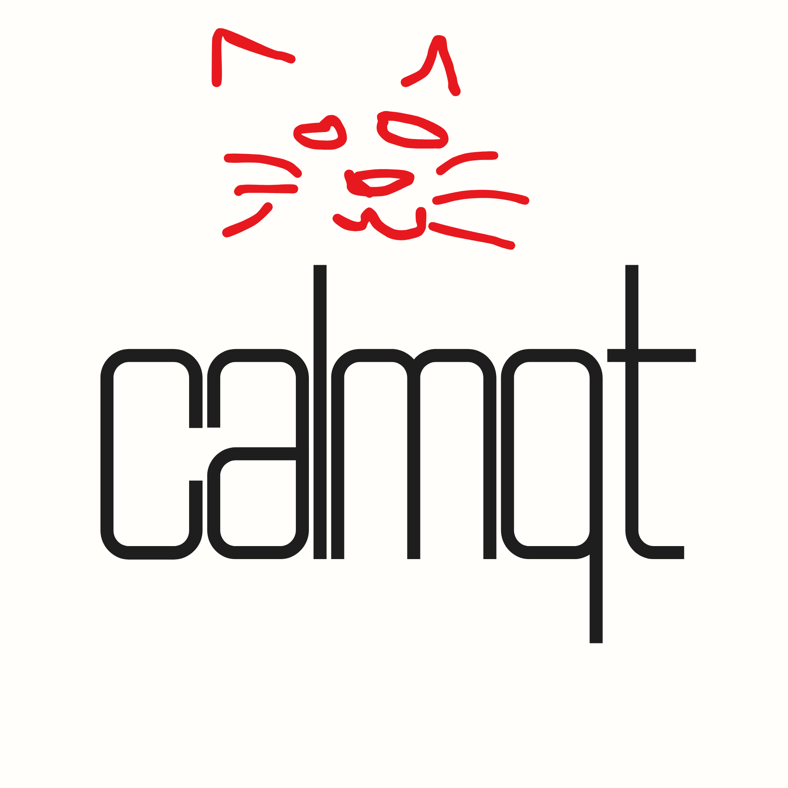

# ClamAV Defense



A polished, beginner-friendly GUI for ClamAV, built with Python and PyQt6.


## Multi-Platform Support
This project now features dedicated versions for different operating systems:
- `open_clam_scanner_mac.py`: Optimized for macOS (Intel & Apple Silicon).
- `open_clam_scanner_linux.py`: Tailored for Linux distributions.
- `open_clam_scanner_windows.py`: Specifically for Windows environments.

**Note: The pre-compiled binaries (.pkg and .zip) are for macOS only. For other systems, you have to compile in your specific system!!**


## Requirements
- Python 3.8+
- PyQt6 (`pip install PyQt6`)
- ClamAV installed on your system.

## Usage
Run the script corresponding to your operating system:
```bash
python open_clam_scanner_[platform].py
```
